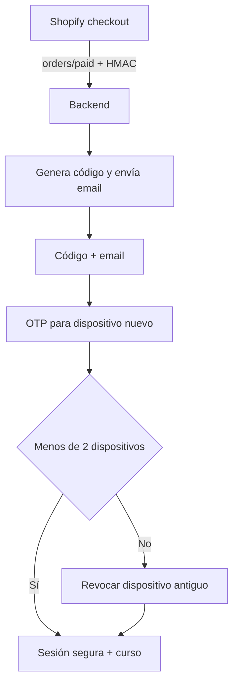

# Abuelo Emilio Academy — Secure Access Gateway

Backend de producción para vender acceso de por vida desde Shopify sin convertir el código en una contraseña compartible.

## Regla del producto

- 1 licencia = 1 comprador.
- El código queda vinculado al email del pedido.
- Máximo 2 dispositivos activos.
- Cada dispositivo nuevo necesita OTP por email.
- Máximo 2 sesiones simultáneas; al superar el límite se revoca la más antigua.
- Si hay un reembolso, el administrador desactiva manualmente el acceso desde el panel.

## Qué incluye

- Node.js + Fastify + PostgreSQL.
- Webhook Shopify `ORDERS_PAID` con HMAC sobre el body original.
- Idempotencia por `X-Shopify-Webhook-Id` y `order_id UNIQUE`.
- Códigos criptográficos `AE-XXXX-XXXX-XXXX`.
- Hash lento `scrypt` + índice HMAC secreto; nunca se guarda el código en claro.
- Entrega de email mediante outbox cifrado con reintentos.
- OTP de un solo uso y caducidad configurable (10 minutos por defecto).
- Cookies de sesión `HttpOnly`, `Secure`, `SameSite`; el código no viaja en URL ni localStorage.
- La sesión necesita también el token del dispositivo.
- Rate limiting persistente en PostgreSQL por IP hasheada y actor/cookie.
- Risk score no bloqueante y panel administrativo separado.
- Recuperación mediante enlace de un solo uso en el fragmento URL; al recuperarse rota el código y revoca sesiones/dispositivos.
- Interfaz móvil en español y ruta de curso protegida `/academy`.

## Flujo



## Inicio local

Requisitos: Node.js 22+ y PostgreSQL 15+.

```bash
cp .env.example .env
# Completa .env con valores de desarrollo
npm ci
npm run migrate
node --env-file=.env src/server.js
```

Abre `http://localhost:3000/access`. En desarrollo se puede usar `EMAIL_PROVIDER=console`; nunca se permite en producción.

## Tests

```bash
npm test
npm audit --omit=dev --audit-level=high
```

La suite cubre generación/hash/cifrado, HMAC Shopify, migraciones PostgreSQL, activación, OTP, límite de dispositivos, sustitución de dispositivo, máximo de sesiones, recuperación, panel admin y borrado del payload sensible del outbox.

## Shopify ya configurado en este proyecto

- Tienda: `academiaemilio.myshopify.com`
- Variante permitida: `63469093847370`
- Checkout: `https://academiaemilio.myshopify.com/cart/63469093847370:1`

Solo una compra que contenga esa variante puede crear una licencia.

Después de desplegar:

1. Configura `APP_URL` con la URL HTTPS definitiva.
2. Instala/configura una app personalizada de Shopify y su webhook `ORDERS_PAID`.
3. Define `SHOPIFY_WEBHOOK_SECRET` en Render.
4. Ejecuta `npm run register:webhooks` dentro de una shell del servicio o localmente con las mismas variables.
5. Cambia el destino de `OBTENER` a `https://TU-DOMINIO/access`.

Consulta [docs/DEPLOYMENT.md](docs/DEPLOYMENT.md) para el procedimiento completo.

## Integrar el curso real

La ruta `/academy` y su script están protegidos por la sesión + dispositivo. Sustituye `protected/course.html` y el contenido de `public/assets/course.js` por el wizard definitivo, manteniendo el script servido desde `/academy/assets/course.js`.

No redirijas a una URL pública externa: eso permitiría saltarse el gateway. Si el curso debe vivir en otro servicio, ese servicio tendrá que validar un ticket de lanzamiento de un solo uso o quedar detrás del mismo gateway.

## Variables

Las variables no secretas de tienda/producto ya están en `render.yaml`. Estas se completan únicamente en Render:

- `APP_URL`
- `SHOPIFY_WEBHOOK_SECRET`
- `EMAIL_FROM`
- `EMAIL_API_KEY` o credenciales SMTP
- `ADMIN_PASSWORD`

Render genera automáticamente `SESSION_SECRET`, `CODE_PEPPER` y `CODE_ENCRYPTION_KEY`. No los cambies después de empezar a vender: rotarlos invalida tokens existentes o impide descifrar emails pendientes.

## Endpoints principales

| Método | Ruta | Uso |
|---|---|---|
| `GET` | `/access` | Pantalla de acceso/compra |
| `POST` | `/api/access/validate` | Valida el código y crea un reto corto |
| `POST` | `/api/access/verify-email` | Comprueba email y envía OTP si es un dispositivo nuevo |
| `POST` | `/api/access/verify-otp` | Autoriza dispositivo o abre gestión de dispositivos |
| `POST` | `/api/access/otp` | Reenvía OTP con cooldown |
| `GET` | `/api/devices` | Lista dispositivos del comprador verificado |
| `POST` | `/api/device/revoke` | Revoca o sustituye un dispositivo |
| `POST` | `/logout` | Revoca la sesión actual |
| `POST` | `/webhooks/shopify/order-paid` | Emite una licencia tras pago válido |
| `GET` | `/admin` | Panel administrativo protegido |

## Límites honestos

Este sistema impide el uso simple del mismo código por muchas personas. Ningún sistema web puede impedir al 100% que alguien comparta un dispositivo completo, copie sus cookies con malware o grabe el contenido. Se evita el fingerprinting invasivo y un cambio normal de IP no bloquea al comprador.

## Licencia

Código privado y propietario de Abuelo Emilio Academy. No se concede permiso de redistribución.
